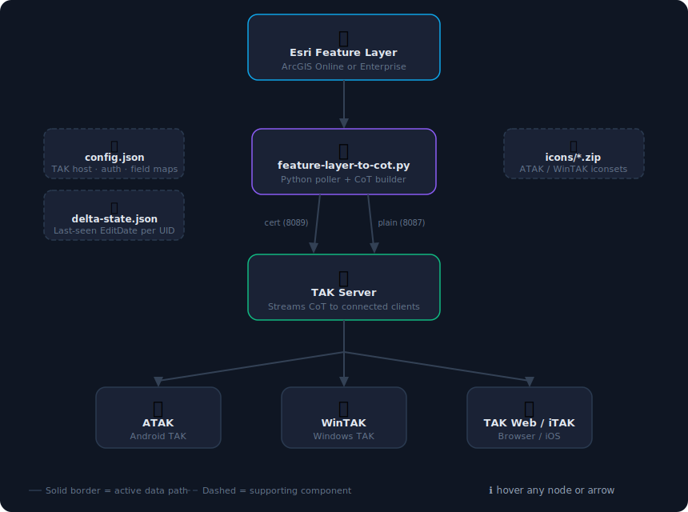

# FeatureLayer → CoT

Polls an Esri Feature Layer (ArcGIS Online or Enterprise) and broadcasts each record as a CoT event to TAK Server, making them visible as PLIs on ATAK, WinTAK, iTAK, and TAK Web.

## Data Flow

<a href="workflow.svg"></a>

> Click the diagram to open the interactive version — hover any node or arrow for details.

## Quick Start

1. Deploy the module from the infra-TAK web UI (Deploy tab)
2. Copy a CA-signed `.p12` cert from `/opt/tak/certs/files/` into `/opt/Esri-TAKServer-Sync/certs/`
3. Fill in the Config tab (TAK host, port `8089`, auth mode `cert`, Feature Layer URL, field mappings)
4. Save config, then start the service from the Service tab

## Authentication Modes

| Mode | Port | Notes |
|------|------|-------|
| `cert` | 8089 | mTLS — recommended. Requires a CA-signed `.p12` from `makeCert.sh` |
| `plain` | 8087 | Unencrypted TCP. Only use on a private/trusted network |

### Generating a cert (TAK Server side)

```bash
cd /opt/tak/certs
./makeCert.sh client esri-push
# Then trust it:
sudo java -jar /opt/tak/utils/UserManager.jar certmod -A /opt/tak/certs/files/esri-push.p12
```

Extract PEM sidecars for the Python script:

```bash
openssl pkcs12 -legacy -in esri-push.p12 -nokeys -out esri-push-cert.pem
openssl pkcs12 -legacy -in esri-push.p12 -nocerts -nodes -out esri-push-key.pem
```

## Icon Mapping

Upload ATAK/WinTAK `.zip` iconsets via the Icons tab. Each zip must contain an `iconset.xml` with a `uid` attribute. Once uploaded you can map a Feature Layer column value → icon path. The poller injects:

```xml
<usericon iconsetpath="uuid/Group/icon-name.png"/>
```

into each CoT event so the correct icon renders on the device.

Icons are stored at `/opt/Esri-TAKServer-Sync/icons/` on the server.

## Delta Tracking

When enabled, the poller only fetches records whose `EditDate` (or a configured field) is newer than the last run. State is persisted to `/opt/Esri-TAKServer-Sync/delta-state.json`. Delete that file to force a full re-broadcast on next start.

## Files

| Path | Purpose |
|------|---------|
| `/opt/Esri-TAKServer-Sync/feature-layer-to-cot.py` | Main worker script |
| `/opt/Esri-TAKServer-Sync/config.json` | Runtime config (written by infra-TAK) |
| `/opt/Esri-TAKServer-Sync/certs/` | TLS cert + key PEM files |
| `/opt/Esri-TAKServer-Sync/icons/` | Uploaded iconset zips |
| `/opt/Esri-TAKServer-Sync/delta-state.json` | Delta tracking state |
| `/etc/systemd/system/feature-layer-to-cot.service` | systemd unit |
| `/var/log/esri-takserver-sync-feature-layer-to-cot.log` | Service log (truncated on restart) |
